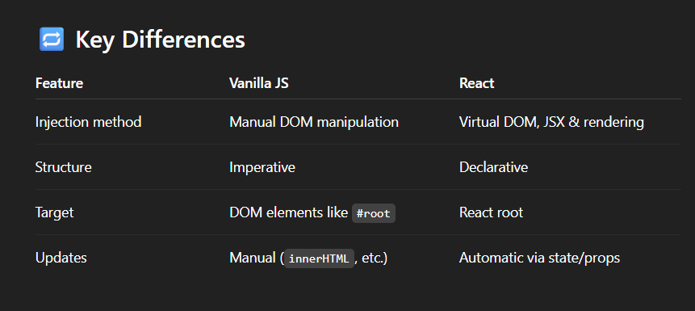

# Understand the react flow and structure

scripts always needs to be called in the HTML when we were working with JS HTML and CSS we were either writing it in script tag or write it in a seperate file and then call in later. But in these kind of cases this is also called script injection (injecting scripts that manipulate the DOM.) which is the same concept that occur in React we target element and put the JS functional code there



There are multiple ways to create React App which can be 'create react app' as well as using npm or any next command they may vary a little.

> Always first file to look into a database is package.json and package.json.lock so you understand what version are running what dependencies are there and what scripts run what command. Understanding of the tools makes the code understanding easier.

* Two types of folder public(public info) and src (contains code). 
* Public - contains `index.html`, `favicon.ico`, as well images.
- we have one HTML file (index.html) as this is always a SPA (Single Page Application)
- All the work is done in the index.html and everything happens in thiis using DOM Manipulation. 
- we have a <div> in index.html with a root id. in the root we do everything.
* in src folder we have index.js(can be renamed) as well as App.js. We have an important concept here of reactDOM. it is an implementation of DOM for react Like React Native is the implementation of React for mobile.

```JS
ReactDOM.createRoot(document.getElementById('root')). // this us used to target elements here root using id and createRoot method which is avaiable in reactDOM
render(
  <React.StrictMode> // this is for developement optimisation
    <App />
  </React.StrictMode>,
)
```

> this know that there is an index.js file where we need to push this but how this uses react scripts it is visible in package.json this is doen when we are using create react app
> but if we use vite to setup the strucutre of the project we will discover that it doesnt use react scripts but rather it puts the script location in the index.html directly so that it can be reffered. 


> 2 types of implementation of creating a react app is seen here and how they are different in their implementation. 

read about root App JSX ReactDOM fragment component and naming

import 

framgment function 

export

difference between modules

> when building components wheather using vite or createreactapp name them with capital in component and function in vite there is files like App.js Chai.js and createreactapp some library or bundleer will want .jsx (like vite).

> script is injected in react to html but ways can be different depending on react script or firect link

root is one 

