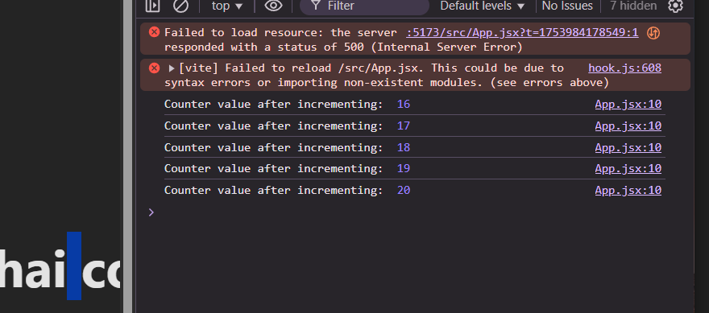
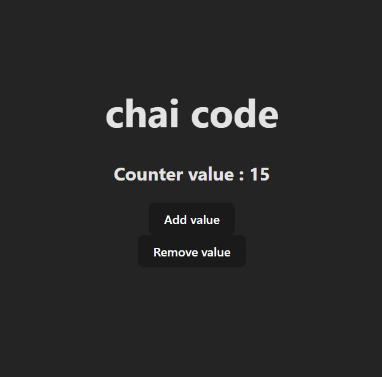

# Why you need hooks 

study things when you need then and why they are being used and how are they being used. 

we can use onClick functionality of Js but it only reflects in the console if console log is printed even thoug hthe value is increasing we are not seeing any update in the UI becaouse to do that we require states to update the screen timely/ here the concept of hooks come into the scene. 

In this example we have one counter and its display so its not that bog of a deal but when we have to manage the state of this counter at 1000 places inside the page then react truely shines and that is how it is used to get rid of the phantom problem which it was initially designed or developed to solve. 

react handle this but taking the control of the UI from the developer to itself to manage everything. and to this we use the concept of Hooks.

you can read about hooks in react github src code in src > `ReactHooks`
