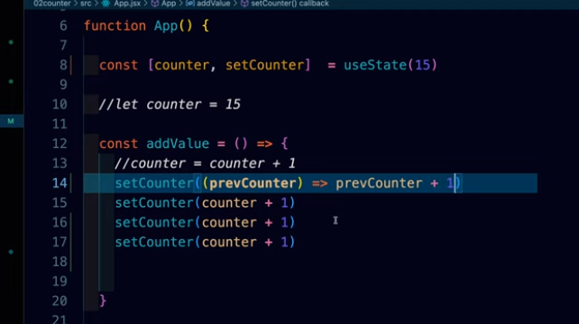

this show how the functionality of fibre works and what inconsitency it can create
we learn about the callback function which is inside the setCounter otherwise if we use setCounter(counter + 1) multiple times will give us addition of value only once as fibre will bundle up everything.

